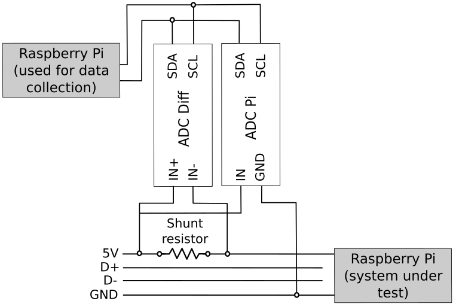

# pi-powermeter
A Device to Measure the Power Consumption of Multiple Raspberry PI's

The device (i.e. powermeter) described here can monitor the power 
consumption of up to 8 USB devices, the limit being the number of channels 
provided by the used Analog to Digital (ADC) converters. The idea is simple, 
consisting in measuring the voltage drop between two extremities of a shunt 
resistor with a differential ADC and using the voltage count of another ADC
to compute the power draw. We provide details on the power meter design and 
sample source code that interfaces with the ADCs' API to collect the power 
measurements. 

## Hardware Design

Raspberry Pi's are devices that can be powered via USB or by providing 5V via 
the GPIO header. The power consumption is measured by inserting a shunt 
resistor in the 5V USB line as depicted in the figure below. The resistor causes 
a voltage drop that is proportional to the current drawn by the Raspberry Pi. 
A differential Analog to Digital Converter (ADC) is used to measure the voltage across the 
resistor (i.e. ADC Diff) in order to compute the amount of current drawn 
by the Pi, whereas the ADC Pi measures the input voltage used to compute the power. 

Both ADCs, manufactured by AB Electronics (https://www.abelectronics.co.uk/), 
are based on the MCP3424 chip from Microchip Technologies Inc and 
provide 8 channels with a resolution of up to 18 bits. 
They can be stacked on a Raspberry Pi's GPIO header.

### Necessary Equipment

Below we first provide a list of the hardware required to assemble 
the power meter. We assume that the number of USB ports that we 
intend to monitor is 3:

<ul>
 <li> 1 ADC Differential Pi - Used to measure the voltage 
 drop across the shunt resistor.
 <li> 1 ADC Pi - Used to measure the input voltage.
 <li> 1 Raspberry PI (2 or higher) onto which the ADCs are connected.
 <li> 3 Resistors 0.1 Ohm, 2 Watts minimum, 1% error or less (one per monitored port).
 <li> Multiple breadboard 28AWG jumper wires, or other preferred type of cable.
 <li> A USB power supply or other 5V power supply capable of providing the power required by 
    the meter and the raspberry PI's. The type of power supply will depend on the number of 
    ports you need and how many devices you intend to monitor; keeping in mind that you need
    at least 2A per port for a Raspberry Pi 3.
 <li> 4 USB to micro USB cables.
 <li> 1 Double-Side Prototype PCB Printed Circuit Board. For example: 
 https://www.amazon.com/Penta-Angel-Double-Side-Prototype-Universal/dp/B012YZ2Q4G
 <li> 1 Electronic enclosure / project junction box. For example: 
 https://www.amazon.com/Electronic-Enclosures-Enclosure-Corrosion-Preventive/dp/B07C3W77GF
</ul>

## Assembling the Power meter

Assembling the power meter should be straightforward if you are familiar with 
using a soldering iron. You need to solder the GPIO connectors to the ADCs along
with the pins used to set up their memory addresses. In our meter we set up the 
differential ADC to use addresses 0x68 and 0x69, and the ADC Pi on 0x6A and 0x6B.
The ground connector on the ADCs should be connected to the GND provided by
the power supply.

You need to cut the USB to Micro USB cables to interrupt the 5V line to connect
the shunt resistor. Try to make the cables used to interconnect the ADCs, 
shunt resistors and PCB board as short as possible and solder them well. 
As the resistance of the shunt resistor is small, any additional resistance 
created by bad connections or long cables can impact the power measurements.

The figure below shows an example of an assembled power meter. We calibrated 
the power meter using another USB power meter device, hence accounting for the
cable and connector resistances.

# Software and Code Examples

AB Electronics UK provides several software tools to interface with their 
Raspberry Pi expansion boards, including libraries in C, C++, Python, NodeJS, 
and Windows IoT. The libraries can be downloaded from their Github
repositories: https://github.com/abelectronicsuk/

For our power meter and code examples we use the Python library. The script 
<code>src/measure.py</code> initialises the ADCs and periodically monitors the
power drawn by 3 USB ports, recording the measurements in a user-specified
output file.